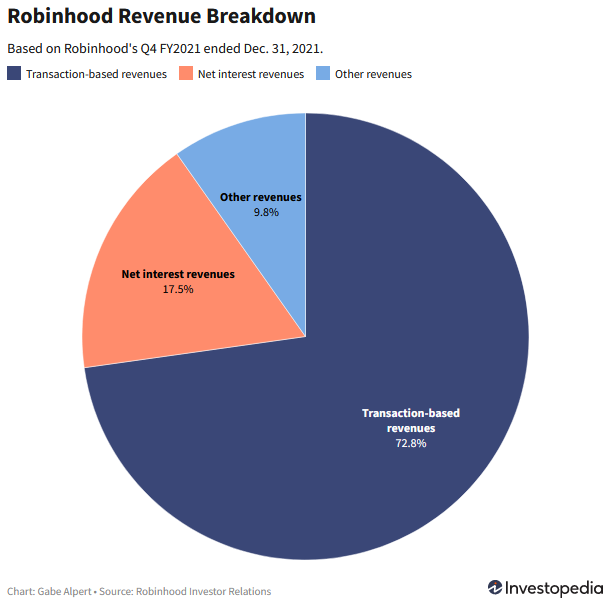

# Robinhood Markets Case Study

## Overview and Origin

Robinhood Markets, Inc. (Robinhood) was founded in 2013 by Vladimir Tenev and Baiju Bhatt to democratize securities trading [1].

Prior to Robinhood's founding, it was common for brokers to charge a flat fee for trades.  This was very expensive for retail investors, because as a percent of their trade size, small investors pay more than large investors when the commission is a flat fee.  For example, if a broker has a flat fee of $5 per trade, then a retail investor who makes a $100 trade would be paying a 5% fee, but an institutional investor who makes a $10,000 trade would only be paying a 0.05% fee.  As a result, flat fees for trades disproportionately affect smaller investors, and Robinhood was created as a fee-free trading platform to give small investors better access to markets.

Robinhood has gone through many rounds of funding both before and after it became a publicly traded company in 2021 (ticker:HOOD) [2,3].  Before its IPO, Robinhood's last round of funding was a Series G, raising $200M in funding from D1 Capital Partners [1].  Most recently, Robinhood raised nearly $650M in a post-IPO secondary round in May 2022 [2].  Altogether, Robinhood has raised approximately $5.73B and its current market capitalization is roughly $9.66B [2,4].

## Business Activities

Robinhood was founded to democratize securities trading.  By offering commission-free trades, it gives retail investors cheaper access to markets, which allows more people to participate.  Robinhood's target demographic is young retail investors.  Young retail investors are tech savvy, but may not have a need for the more complicated trading tools that are offered by some of Robinhood's competitors, like E*Trade and Charles Schwab [5].  As of July 2023, Robinhood had 10.8M active users, which is down from its peak of 22.5M annual users in 2021 [6].  Relative to the competition, Robinhood has more users, but the average account size is significantly smaller [6,23].

Robinhood has a variety of revenue streams [7].  A significant portion of its revenue comes from payment for order flow (PFOF), which subsidizes the transaction cost of executing its users' trades.  In a PFOF system, the market maker pockets the difference between the bid and ask prices, and a portion of that difference is paid to the broker who took the order.  So when a user makes a trade, Robinhood routes the trade through a market maker, and in exchange, the market maker pays Robinhood a small fee for the volume.  The purpose of a PFOF system is to add liquidity to the market, and PFOF is legal in the United States as long as the broker and market maker fulfill their fiduciary duty to execute the trade at the best price for the customer [8].  The PFOF system enables Robinhood to offer commission-free trades to its users while still receiving compensation for its brokerage services.  Robinhood's other revenue streams are more traditional, including investing cash deposits at higher interest rates and charging customers for premium financial services [7].

Historically, Robinhood's competitive advantage has been that it offers cheap access to markets and a user-friendly mobile interface, with significantly less overhead than its competition [5].  However, in the last few years, many of its competitors like E*Trade and Charles Schwab have also introduced commission-free trades, which has mitigated some of the competitive advantage that Robinhood once had.  Nevertheless, Robinhood maintains a significant market share of the people who use a mobile app as their primary trading platform and they continue to pursue alternative revenue streams [6,7].

Robinhood uses a variety of different technologies as a part of its tech stack [9].  To store and manipulate data, they use PostgreSQL and Python.  Their server and cloud technologies include NGINX and Amazon EC2.  Their user interface is built with React JS and Bootstrap.  Their DevOps takes advantage of Git, GitHub, Docker, and Kubernetes.

## Landscape

Robinhood is primarily a securities trading platform, but it also generates revenue in credit risk and wealth management [7].  As a securities trading platform, Robinhood makes money from market makers through PFOF.  As a lender, Robinhood earns interest revenue on margin loans to customers.  Recently, Robinhood announced that it would also start offering retirement accounts and services, thereby bringing it into the wealth management space.

In the last 10 years, there have been a lot of changes in the securities trading domain.  Robinhood was a pioneer in 2013 for introducing commission-free trades, which to this day enable many retail investors to participate in the markets.  Since then, many of Robinhood's brokerage competitors have introduced commission-free trades to remain competitive, including Charles Schwab, E*Trade, Fidelity, TD Ameritrade, Merrill Edge, and Vanguard [10].  Additionally, there has been an increased emphasis on mobile trading, because the prevalence of smartphones has changed the way people want to interact with their broker [5].  Another innovation was the advent and popularity of fractional shares, which allow people to buy a part of a share that they otherwise couldn't afford.  Fractional shares were first offered by a brokerage named BuyandHold, but the service didn't catch on until 2017 when M1 Finance started offering them.  Robinhood started offering fractional shares in 2019 [11,12,13].

In the credit risk domain, many of the recent advancements revolve around better analytics, modeling, and customer targeting [14].  Anything that can help improve a company's credit model, reduce exposure to fraud, reduce portfolio risk, and improve collections is extremely valuable in the credit risk industry, and tools like artificial intellience and machine learning are helping lead the way.  Improving the customer experience can also lead to improved collections, which is similarly important for reducing defaults.

In the wealth management space, one of the key recent developments has been the increase in interest rates.  The federal funds rate is currently 5.25-5.50%, which is the highest its been in 15 years [15].  The federal funds rate doesn't just affect banks - it also affects consumer financial products like mortgages and car loans.  For much of the last 15 years, the federal funds rate was only 0.25%, which resulted in relatively cheap access to credit.  As the interest rates increase, the wealth management strategies will have to change, but it will also affect retail investors' appetite for risk and Robinhood's revenue as a margin lender [16].

Robinhood's primary competitors are other brokerage firms, including the ones listed above, and many of them participate in similar financial activities, such as brokerage services, margin lending, and wealth management.  The primary differentiator between the firms seems to be their target markets.  Robinhood was founded to help democratize securities trading, but Charles Schwab has been a reliable discount broker for a long time.  Some of the brokers cater to clients with more money, prioritizing personal relationships and guidance over more efficient, self-guided platforms.

## Results

Robinhood has had a significant impact on the securities trading industry.  Their approach of offering commission-free trades and a sleek mobile interface has attracted a new generation of investors, including investors from underrepresented demographics relative to other brokerage firms [17].  Traditional brokerages have had to offer similar products and services to stay competitive, and which has recently affected the year-over-year growth of Robinhood's market share.  Additionally, as a pioneer in the space, Robinhood has occasionally found itself at the center of controversy.  For example, in January 2021, Robinhood had to temporarily stop its users from purchasing Gamestop (GME) stock during a short squeeze, resulting in angry users and eventually a report from the House Committee on Financial Services [18,19].  At this time, Robinhood was unable to meet the collateral requirements for purchasing shares because of the surge in user interest in GME stock, but Robinhood's users typically don't have to pay attention to Robinhood's liquidity requirements.  Systemically, one downside of making it easier to trade securities is that it increases the volatility in the market, and the GME short squeeze was an example of an anomalous event that Robinhood wasn't prepared to handle that negatively affected its users and public image.

For now, Robinhood seems like a still-growing company that faces strong headwinds from competitors.  Some of the important business metrics for Robinhood would be active users, average account size, valuation/market capitalization, revenue, and profit.  Several of these metrics peaked in 2021, including active users, valuation/market capitalization, and revenue [6].  Robinhood had 10.8M active users in July 2023, down from 21.3M active users in July 2021 [21].  According to Business of Apps, "Robinhood's valuation maxed at $20 billion in 2021, but has since taken a nosedive to $10.4 billion in 2023" [20].  Robinhood's market capitalization varies with its stock price, but assuming it has 911M outstanding shares and a stock price of $9.53 (closing price on 9/26/23), Robinhood's current market capitalization would be roughly $8.7B [22].  Robinhood's revenue per quarter peaked in 2021, but it is recovering from having dipped in 2022 [6,21].  Q2 2023 was Robinhood's first profitable quarter (net income $25M) and their net revenue was $486M [21].  

Relative to its competitors, Robinhood is a much smaller company.  By annual revenue in 2022:
- Robinhood: $1.36B [24]
- E*Trade: $2.9B (estimated, E-Trade is owned by Morgan Stanley) [27]
- Fidelity: $11.56B [26]
- Charles Schwab: $20.76B [25]
Similarly, Robinhood also has a much smaller average account size [23]:
- Robinhood: $4,000
- E-Trade $127,000
- Fidelity: $279,000
- Charles Schwab: $234,000
However, Robinhood has a significant market share of the people who use an app as their primary trading platform [6].  As a relatively young company, Robinhood seems to have prioritized their growth and market share over per-customer efficiency, but their aggressive growth has caught the attention of their competition.  Many of Robinhood's competitors started offering commission-free trades to keep up with Robinhood, and in the last few years, Robinhood has started offering other financial services to create more revenue streams.

## Recommendations

Robinhood's 2021 revenue breakdown looked like this [7]:

By section, the transaction-based revenues (72.8%) are mostly from PFOF, the net interest revenues (17.5%) are from Robinhood's lending practices, and the other revenues (9.8%) are mostly from membership fees to Robinhood Gold, which is a paid subscription service [7].

At a glance, Robinhood has a significant competitive advantage in the transaction-based revenue space.  Robinhood has a large mobile userbase, and even though their users' accounts are small, Robinhood users get commission-free trades and Robinhood makes money whenever their users trade securities.  If I were to give Robinhood advice on growing their business, one option would be to focus on increasing their market share.  The number of active users is down relative to its peak, but Robinhood's largest revenue stream is proportional to the number of trades that take place on its platform.  By attracting new customers to the platform, Robinhood can make more money where it has a competitive advantage, and they don't have to change much about their current core business.

I would also advise Robinhood to grow the wealth management portion of their business.  Initially, Robinhood's target market was tech-savvy millenials, but at this point, Robinhood should pursue other markets as well.  Robinhood recently announced they would offer individual retirement accounts (IRAs), which is a great option for Robinhood's business.  It synergizes with Robinhood's current customers, because millenials are starting to save for retirement, but it's also a new market, which allows Robinhood to pursue older, often wealthier customers that were outside of Robinhood's initial target market.

Both of those strategies would require acquiring new customers, and there are many technologies that could help with that.  Advanced modeling and regression techniques can be used to identify potential customers, and similar modeling and regression techniques can be used to develop a marketing campaign designed to attract those customers to Robinhood.  The user experience could also be customized to reflect how investors like to use Robinhood's platform, which would involve additional market research.  Ultimately, the goal is to take advantage of Robinhood's strengths and existing infrastructure while still pursuing complimentary avenues for making more money.

## References

[1] https://en.wikipedia.org/wiki/Robinhood_Markets

[2] https://tracxn.com/d/companies/robinhood/__ftFGCJ3CCjzKvgmHzIC3I7cNIjrIk2k6uypP6P1qOWk

[3] https://www.crunchbase.com/organization/robinhood/company_financials

[4] https://finance.yahoo.com/quote/HOOD/key-statistics/

[5] https://www.forbes.com/sites/halahtouryalai/2014/02/26/forget-10-trades-meet-robinhood-new-brokerage-targets-millennials-with-little-cash/

[6] https://www.businessofapps.com/data/robinhood-statistics/

[7] https://www.investopedia.com/articles/active-trading/020515/how-robinhood-makes-money.asp

[8] https://www.investopedia.com/terms/p/paymentoforderflow.asp

[9] https://stackshare.io/robinhood/robinhood

[10] https://money.usnews.com/investing/portfolio-management/articles/brokers-that-offer-commission-free-trading

[11] https://www.nytimes.com/1999/12/19/business/investing-diary-a-fraction-at-a-time.html

[12] https://www.thestreet.com/dictionary/f/fractional-shares

[13] https://www.washingtonpost.com/business/2020/07/10/shares-by-slice-fractional-investing-sparks-stock-market-stampede/

[14] https://www.forbes.com/sites/forbesfinancecouncil/2023/04/26/managing-credit-risk-for-fintechs-innovative-strategies-for-a-data-driven-future/

[15] https://tradingeconomics.com/united-states/interest-rate

[16] https://www.bernstein.com/our-insights/insights/2023/articles/does-margin-still-work-amid-higher-rates.html

[17] https://www.cnbc.com/2021/05/25/robinhoods-disruptive-trade-the-good-the-bad-and-the-controversy.html

[18] https://en.wikipedia.org/wiki/GameStop_short_squeeze

[19] https://techcrunch.com/2022/06/27/robinhood-report-meme-stock-gamestop/

[20] 

[21] https://qz.com/robinhood-earnings-2023-stock-profit-high-interest-rate-1850702775

[22] https://ycharts.com/companies/HOOD/shares_outstanding

[23] https://brokerchooser.com/education/news/data-dashboard/brokerage-account-sizes

[24] https://www.macrotrends.net/stocks/charts/HOOD/robinhood-markets/revenue

[25] https://www.macrotrends.net/stocks/charts/SCHW/charles-schwab/revenue

[26] https://www.macrotrends.net/stocks/charts/FNF/fidelity-national-financial/revenue

[27] https://www.zippia.com/e-trade-financial-careers-3640/revenue/